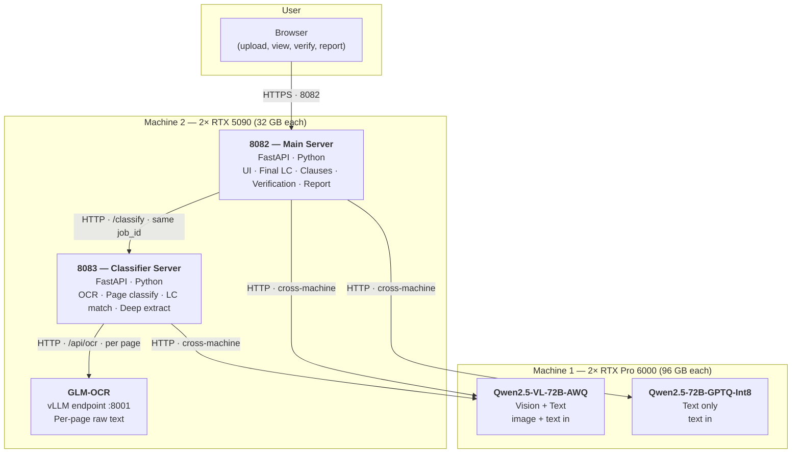
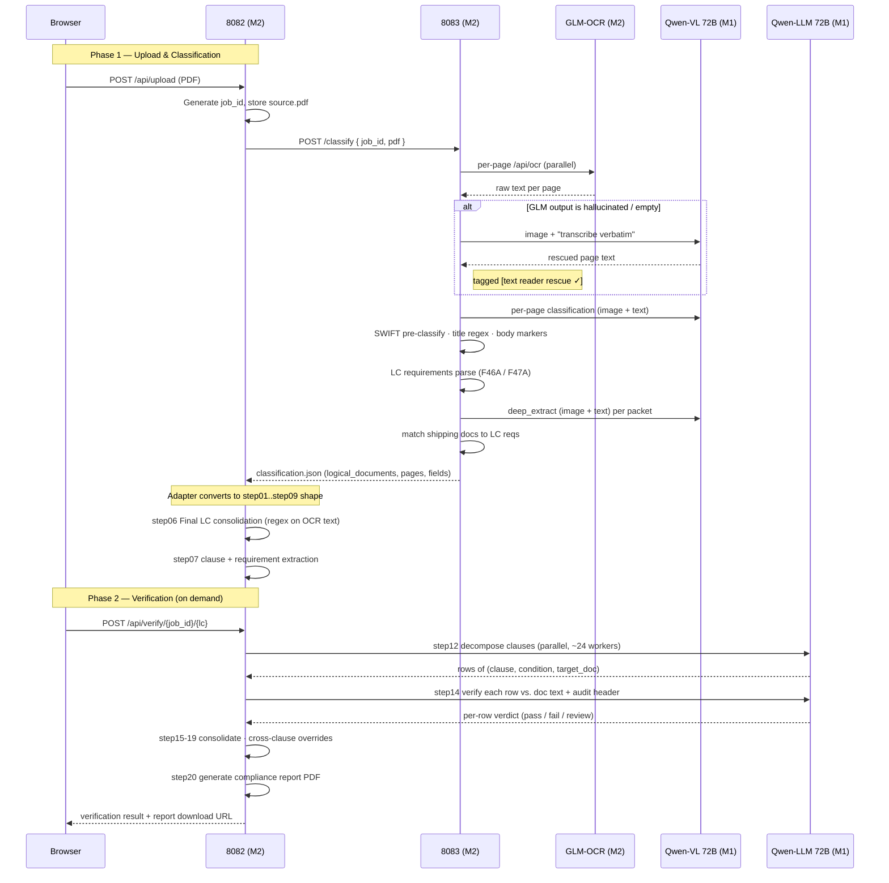

# ComplyTrade — System Architecture

Two-machine deployment. Machine 2 hosts the applications + the lightweight
OCR model; Machine 1 hosts the heavy 72B vision + text LLMs.

---

## 1. Topology (high-level)



---

## 2. Service responsibilities

| Where | Service | Owns |
|-------|---------|------|
| Machine 2 | **8082 main server** | Upload UI · job state · step06 Final LC · step07 clause/requirement extraction · step12-14 verification fan-out · step15-20 report generation · serves all HTML views |
| Machine 2 | **8083 classifier server** | Page-level OCR · per-page document type classification · SWIFT pre-classification · LC requirements parse (F46A/F47A) · document matching · deep field extraction · stamps/signatures · positioned-text |
| Machine 2 | **GLM-OCR** (vLLM) | Step 1 — raw per-page text from PDF page images. Lightweight enough to fit on the 5090s alongside the app servers. |
| Machine 1 | **Qwen2.5-VL-72B (AWQ)** | Image + text reasoning. Used by 8083 (Step 2 VLM rescue, deep_extract field recovery, page classification, doc matching) AND by 8082 (clause decomposition image checks). |
| Machine 1 | **Qwen2.5-72B (GPTQ-Int8)** | Text-only reasoning. Used by 8082 step12 (clause decomposition), step14 (verification of every condition), step06 amendment merge. |

---

## 3. End-to-end request flow (one upload, one verify)



---

## 4. Detailed component layout

```
┌───────────────────────────────────────────────────────────────────────────────┐
│                                                                                │
│                                USER BROWSER                                    │
│                       (upload · checklist · report)                            │
│                                                                                │
└──────────────────────────────────────┬─────────────────────────────────────────┘
                                       │ HTTPS · port 8082
                                       ▼
┌───────────────────────────────────────────────────────────────────────────────┐
│  MACHINE 2 — 2× RTX 5090 (32 GB each) — application + light OCR                │
│  ────────────────────────────────────────────────────────────────────────────  │
│                                                                                 │
│    ┌─────────────────────────────────────┐                                      │
│    │   8082 — Main Server (FastAPI)      │                                      │
│    │   ────────────────────────────      │                                      │
│    │   • Web UI (HTML)                    │                                      │
│    │   • /api/upload, /api/result        │                                      │
│    │   • step06 Final LC consolidation   │                                      │
│    │   • step07 LC clause extraction     │                                      │
│    │   • step10 traceability              │                                      │
│    │   • step12 clause decomposition ─────┐                                     │
│    │   • step14 verification ──────────────┼─────► LLM (M1)                     │
│    │   • step15-19 consolidation          │                                     │
│    │   • step20 report PDF                │                                     │
│    └──────────────┬──────────────────────┘                                      │
│                   │ HTTP (loopback)                                              │
│                   │ /classify + same job_id                                      │
│                   ▼                                                              │
│    ┌─────────────────────────────────────┐                                      │
│    │   8083 — Classifier (FastAPI)        │                                      │
│    │   ────────────────────────────      │                                      │
│    │   • /classify (entry point)          │                                      │
│    │   • Step 1: GLM OCR ──┐              │                                      │
│    │   • Step 2: VLM rescue ┼─► (fires on hallucinated GLM output)              │
│    │   • Per-page classify  ┘             │                                      │
│    │   • SWIFT pre-classify (regex)       │                                      │
│    │   • LC requirements parse            │                                      │
│    │   • Doc matching (originals+copies) ─────► VLM (M1)                        │
│    │   • Deep extract (fields, stamps) ───────► VLM (M1)                        │
│    │   • Positioned-text (Qwen-VL bbox) ──────► VLM (M1)                        │
│    └──────────────┬──────────────────────┘                                      │
│                   │ HTTP (loopback)                                              │
│                   │ /api/ocr                                                     │
│                   ▼                                                              │
│    ┌─────────────────────────────────────┐                                      │
│    │   GLM-OCR — vLLM endpoint :8001     │                                      │
│    │   ────────────────────────────      │                                      │
│    │   • Raw text per PDF page            │                                      │
│    │   • Hallucination-prone on faint     │                                      │
│    │     scans (handled by VLM rescue)   │                                      │
│    └─────────────────────────────────────┘                                      │
│                                                                                 │
└─────────────────────────────────┬───────────────────────────────────────────────┘
                                  │
                                  │  HTTP over LAN
                                  │  (cross-machine — both apps + VLM)
                                  │
                                  ▼
┌───────────────────────────────────────────────────────────────────────────────┐
│  MACHINE 1 — 2× RTX Pro 6000 (96 GB each) — heavy 72B inference                │
│  ────────────────────────────────────────────────────────────────────────────  │
│                                                                                 │
│   ┌─────────────────────────────────┐    ┌─────────────────────────────────┐    │
│   │  Qwen2.5-VL-72B-Instruct-AWQ    │    │  Qwen2.5-72B-Instruct-GPTQ-Int8 │    │
│   │  (Vision + Text)                 │    │  (Text only)                     │    │
│   │  ─────────────────────────────  │    │  ─────────────────────────────  │    │
│   │  Called by 8083 for:             │    │  Called by 8082 for:             │    │
│   │   • Step 2 VLM OCR rescue        │    │   • step12 clause decompose     │    │
│   │   • Per-page doc-type classify   │    │   • step14 verification (fan-out│    │
│   │   • Deep field extract           │    │     to ~24 parallel workers)    │    │
│   │   • Stamps / signatures detect   │    │   • step06 amendment merge      │    │
│   │   • Doc-to-LC matching           │    │                                  │    │
│   │   • Positioned-text bbox         │    │  Called by 8083 for:             │    │
│   │                                   │    │   • text-only deep_extract fall │    │
│   │  Called by 8082 for:             │    │     back when no image needed   │    │
│   │   • (none currently — was used   │    │                                  │    │
│   │     for legacy step01-05; new    │    │                                  │    │
│   │     8083 path owns vision)       │    │                                  │    │
│   └─────────────────────────────────┘    └─────────────────────────────────┘    │
│                                                                                 │
└───────────────────────────────────────────────────────────────────────────────┘
```

---

## 5. Network endpoints (from `.env`)

```
Machine 2 (apps)
────────────────
  8082 main server          http://M2:8082
  8083 classifier            http://localhost:8083   (8082 → 8083 over loopback)
  GLM-OCR                    http://10.20.10.2:8001/api/ocr   (8083 → GLM)
                             — fallback: http://34.171.200.116/api/ocr (GCP)

Machine 1 (heavy LLMs)
──────────────────────
  Qwen-VL 72B (AWQ)          http://M1:.../vllm/v1/chat/completions
  Qwen-LLM 72B (GPTQ-Int8)   http://M1:.../v1/chat/completions
```

8082 holds the persistent job state (`_jobs` dict + `results/<job_id>/`). 8083
stores its own per-job artifacts (`source.pdf`, page images, `classification.json`,
position cache) — **under the same job_id**, so 8082 can proxy
`/api/page-image`, `/api/page-positions`, cancel, and delete cleanly.

---

## 6. Why the two-stage OCR (GLM + VLM rescue)

GLM-OCR is fast and accurate on clean prints but occasionally hallucinates
prompt-template filler on faint / low-contrast scans (e.g. paper SWIFT MT700
receipts) — producing lines like *"Use a consistent font size throughout
the document"* instead of the actual LC text.

The 8083 pipeline now runs a **second pass with Qwen-VL** whenever GLM output
fails a hallucination guard. Qwen-VL reads the same page image and
re-transcribes verbatim. Per-page logs show one of:

| Tag | Meaning |
|-----|---------|
| (no tag) | GLM was clean, used as-is |
| `[text reader lines stripped]` | GLM had a few junk lines; stripped, rest kept |
| `[text reader rescue ✓]` | GLM hallucinated; Qwen-VL recovered the page |
| `[text reader blank]` | GLM output was minimal AND VLM rescue not attempted |
| `[text reader+trade expert blank]` | Both GLM and Qwen-VL agreed the page is blank |

---

## 7. Failure modes & fallbacks

| Scenario | Behavior |
|----------|----------|
| GLM-OCR hallucinates | Qwen-VL re-OCRs the page (Step 2 rescue) |
| Qwen-VL deep_extract fails | Falls back to text-only LLM extract, then regex scrape |
| `:20:` not in OCR text | Server pulls `LC Number` from 8083 deep_extract for the result page |
| `:31C:` not in OCR text | Server pulls `Document Date` from 8083 deep_extract |
| step14 worker exception | One synchronous retry; on second failure → row marked REVIEW |
| 8083 unreachable from 8082 | `/api/upload` returns clear error; UI displays it |
| Verification gets blank doc text | Audit header (status flags, signing capacity, must-show, counts) still gives the LLM enough context to reason |
